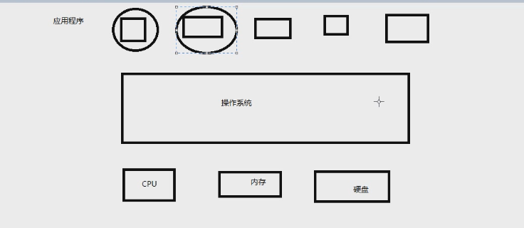

# 计算机基础

- cpu
- 内存
- 硬盘
- 操作系统
- 应用程序

## cpu

- 大脑
- 计算

## 内存

- 临时存放数据
- cpu从内存中取数据
- 速度比硬盘快
- 4G 8G 16G 32G
- 造价贵，成本高，断电易消失

## 硬盘

- 1T
- 固态硬盘 速度比机械硬盘快
- 机械硬盘
- 储存应该长久保持的数据 重要文件

## 操作系统

- 点击qq图标，操作系统把硬盘中的qq文件加载到内存，cpu执行程序

## 应用程序

- 应用程序在操作系统之上

