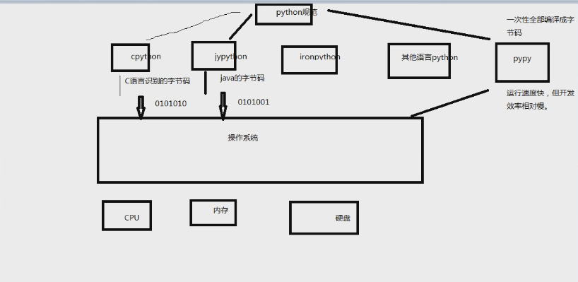

# python分类

## python环境

- 编译型语言：编译器一次性将代码编译成二进制机器语言 开发效率低 不能跨平台 运行效率高 c/c++
- 解释型语言：程序执行时，解释器一行一行的解释 开发效率高 跨平台 运行效率低 python/php
- 混合型语言：java/c#
- 动态 解释型 强类型语言

## python优缺点

- 优点：明确 简单 优雅 开发效率高(第三方库) 跨平台 可扩展 可嵌入
- 缺点：相对于c运行慢 代码不能加密 全局锁影响多线程并发

## python种类

- 解释器种类
- cpython 默认 转换成c语言的字节码 再转换为机器语言
- jypython java
- ironpython
- pypy 一次性全部编译再运行
- 


## python安装

- https://www.python.org/downloads/
- 3.6的最新版本
- 添加环境变量
- 安装到c盘
- cmd python 查看版本

```
C:\Users\xuluchuan>python
Python 3.6.7 (v3.6.7:6ec5cf24b7, Oct 20 2018, 13:35:33) [MSC v.1900 64 bit (AMD6
4)] on win32
Type "help", "copyright", "credits" or "license" for more information.
>>> quit()
```
